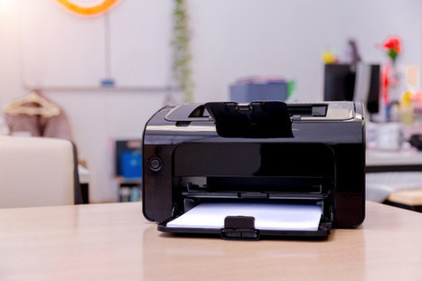

.. raw:: html

   <header style="background-color: #003366; color: white; padding: 20px; text-align: center;">
       <h1>HP Printer Setup Guide</h1>
       
Your Complete Guide to Setting Up HP Printers

   </header>

123.hp.com/setup
===============

|

Welcome to the HP Printer Setup Guide! This guide will help you easily set up and install your HP printer for both Mac and Windows systems. Follow the steps below for a hassle-free experience.

.. contents::
   :local:
   :depth: 2

Introduction
------------

HP printers are among the easiest devices to set up. Whether you're using a wired or wireless connection, the process requires minimal technical knowledge. Make sure you have:
- The printer device
- Printer drivers
- Setup manual
- Necessary cables (for wired/USB printers)

|

How to Download HP Driver for Mac
---------------------------------

Follow these steps to download the HP printer driver on your Mac:

1. Open the browser on your Mac device.
2. Go to the official website: **123.hp.com/setup**.
3. Enter the model number of your HP printer.
4. Download the compatible driver for your printer.
5. Save the driver in a dedicated folder.
6. Open the **HP Smart App**. If it's not installed, download and install it from the App Store.
7. Launch the app and add your printer.
8. Select the downloaded driver and run the installation process.
9. Accept the terms and conditions when prompted.
10. Follow the on-screen instructions to complete the setup.

How to Install HP Driver on Mac
-------------------------------

1. Open a web browser on your Mac system.
2. Navigate to the official website: **123.hp.com/setup**.
3. Enter your HP printer model number.
4. Choose the **HP Driver Download** option and download the driver.
5. Open the downloaded file by double-clicking it.
6. Follow the on-screen instructions to complete the installation.
7. Move to the HP Installer window on your desktop to finalize the setup process.

Setup and Installation of HP Printer
-------------------------------------

Here’s how you can set up your HP printer step by step:

1. **Unbox the Printer**:
   - Remove all packaging materials and protective tapes from the printer.

2. **Position the Paper**:
   - Load paper into the paper tray.

3. **Connect the Printer**:
   - Plug the power cord into the printer and turn it on.

4. **Install Ink Cartridges**:
   - Place the ink cartridges in the designated slots.

5. **Download and Install Drivers**:
   - Visit **123.hp.com/setup**, download the drivers, and follow the installation instructions.

6. **Start Printing**:
   - Complete the setup and begin using your HP printer.

Contact Support
---------------

If you encounter any issues during setup, feel free to contact HP support for assistance.

.. raw:: html

   <footer style="background-color: #003366; color: white; padding: 20px; text-align: center;">
       
&copy; 2025 HP Printer Setup | Powered by HP Printer Setup

   </footer>
